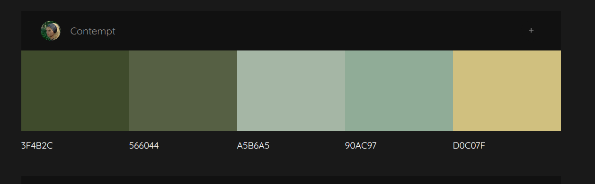
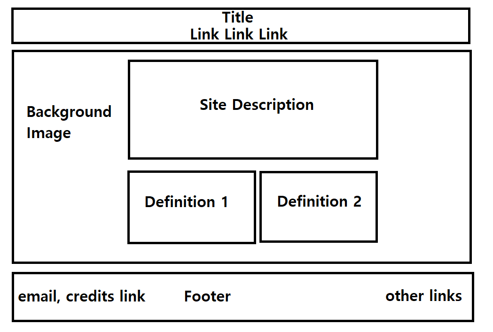
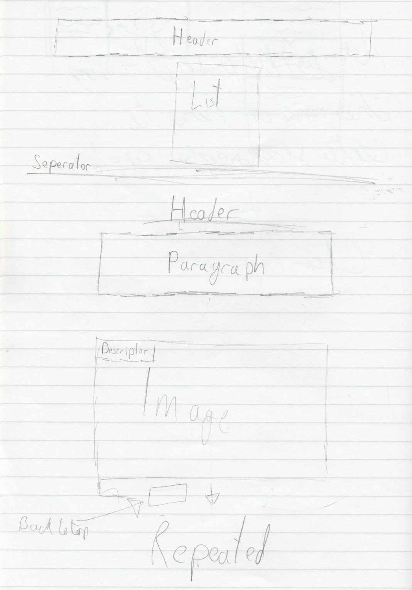
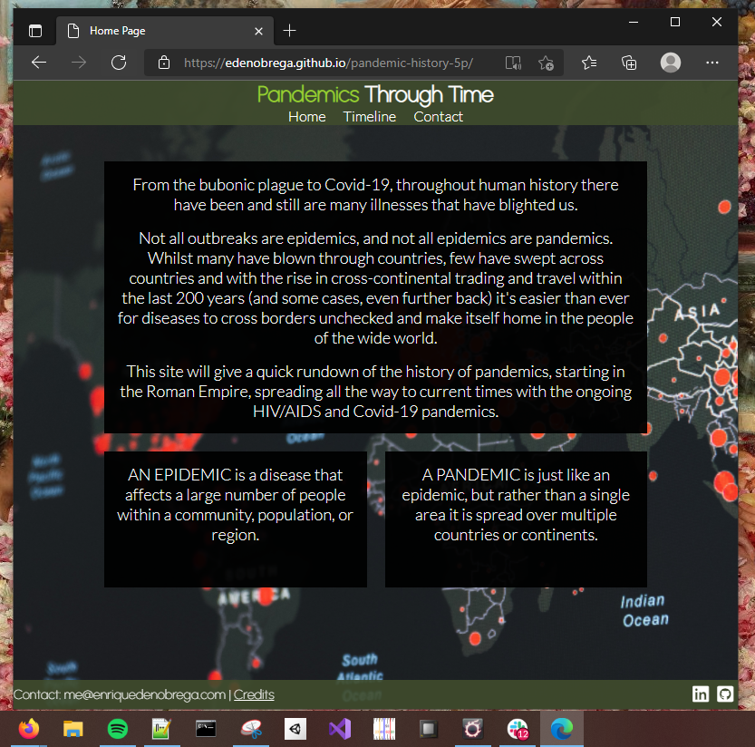
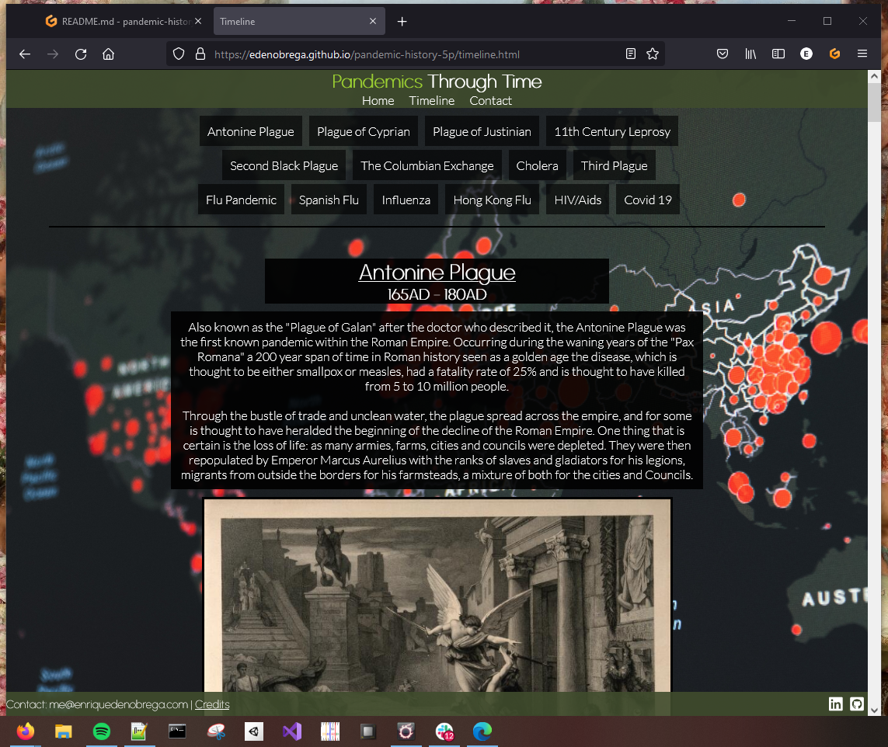
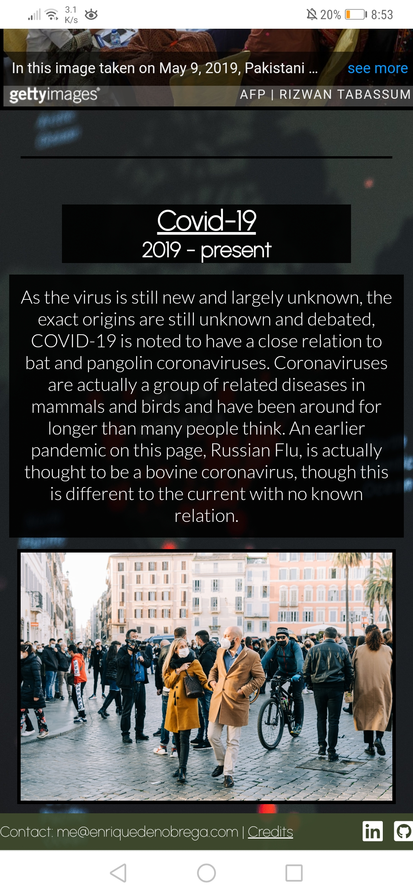
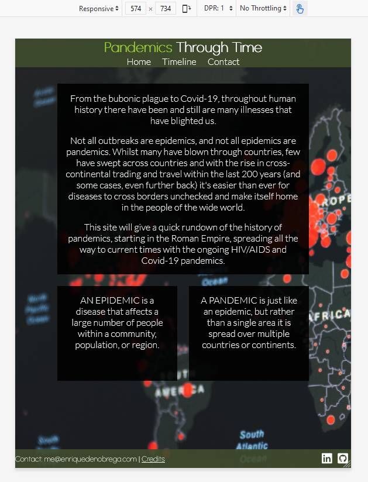
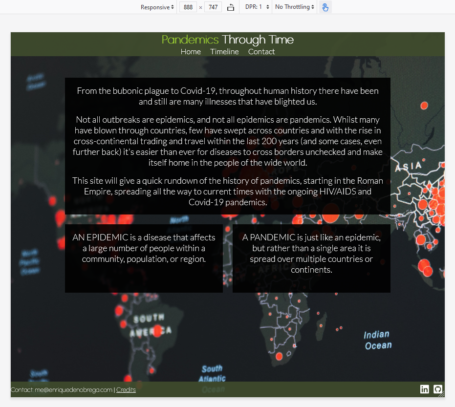
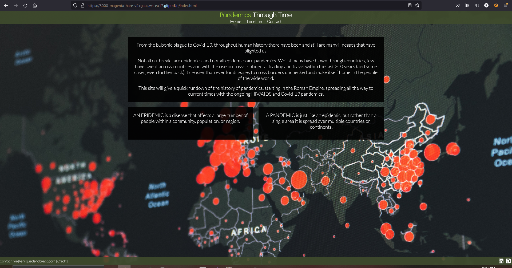

# Panedmics Through Time

__Pandemics through time__ is an informational website with the purpose of giving people a brief history of pandemics we have had throughout the years, as for many people, outside of the bubonic plague, the current ongoing Covid-19 pandemic is the largest and most deadly disease to harm and kill humans, and this site aims to give people a starting to point to get a rough understanding of other pandemics.

## UX
For the design i opted to have a background image covering the whole page rather than having a solid color. Any sort of text that is displayed will be inside of a transparent box to help with readability without completely hiding the background image. Elements will have padding on both left and right and be typically always ben kept centered on screen, as this is a site used to convey information in a specific order having them all inline going down the page will make it extremely easy for people to go through the website and see everything without missing out.

### Color Scheme
I used [colormind](http://colormind.io/) to find a color pallete for my site, using the one shown below. I chose these because when talking about disease and illness, lighter shades of green and yellow are typically the first colors that come to mind and are used in many paintings and artwork depicting disease. Although i do not plan on using all the colors outside of the first two, as i plan on having the background as an image and black textboxes with white text for readability.

*Scheme Used*

### Typography
To select my fonts i used [google fonts](https://fonts.google.com/)

I chose to use a more decroative font, urbanist, for the title and headers, and opted for a more readable font, Lato, for the paragraphs of text.
For the links on the footer i used font-awesome as its easy to use and has many logos for any sort of website i would like to link.

### Wireframes

*Final wireframe for homepage*

*Wireframe for timeline*

## Features
### Existing Features
- Header / Navigation bar
    - On all 4 pages, slightly transparent and is responsive. Displays the name of the site and a navigation bar to 3 of the 4 pages
    - Allows for easy navigation of the site

- Footer
    - Contains my email for contact
    - A link to the credits where all of the sources for images etc, are listed
    - On the right hand side is 4 icons each leading to my social medias (although i only have linkedin)

- Timeline
    - The main content of the site, a vertically explored page that goes through the history of pandemics starting from the earliest known ones, to the most current one being Covid-19
    - The start and end date (if its ended) of the pandemic shown on the left hand side with the left consisting of a block text and the background area being a relevant picture to the spoken about pandemic

- Contact
    - A page for users to inqure about the site, correct and/or add to the site with there own information or sources that may improve on it.

- Credits
    - A list of all the sources of information, images, definitions, that was used in the site

### Features Left to Implement
Contact page + credits

## Technologies Used
While working on this project i made use of a few tools, to store and version my code i used github + git. To develop the site i used gitpod which being a cloud IDE came handy as it gave me the ability to deploy the website to be accessed on any device other than my local device which allowed me to easily see the website on different devices such as tablets and phones, which gives me a better idea of what the site looks like without using inbrowser tools.

- To create the layout of the three paragraphs on the home page i used css grid, to easily create the grid i used this the [website](https://cssgrid-generator.netlify.app/) shown below.

- I used html and css, [example](https://en.wikipedia.org/wiki/Main_Page)
- To help with styling i used a css debugger to help me with things like positioning and size, [link](https://github.com/benscabbia/x-ray)
- For my ide i used gitpod, [link](https://www.gitpod.io/)

## Testing

### Browser Compatibility
 
*Index.html shown in edge*

*Timeline.html shown in firefox*
### Code Validation
For validation i used two tools from w3, for css i used [this](https://validator.w3.org/nu/) and for html i used [this](https://jigsaw.w3.org/css-validator/) site  

#### style.css
[Validation of the style sheet that styles the header and footer](https://jigsaw.w3.org/css-validator/validator?uri=https%3A%2F%2Fedenobrega.github.io%2Fpandemic-history-5p%2Fassets%2Fcss%2Fstyle.css&profile=css3svg&usermedium=all&warning=1&vextwarning=&lang=en)

#### Index
[HTML Validation, giving no errors](https://validator.w3.org/nu/?doc=https%3A%2F%2Fedenobrega.github.io%2Fpandemic-history-5p%2Findex.html)

[CSS Validation, also giving no errors](https://jigsaw.w3.org/css-validator/validator?uri=https%3A%2F%2Fedenobrega.github.io%2Fpandemic-history-5p%2Fassets%2Fcss%2Findex.css&profile=css3svg&usermedium=all&warning=1&vextwarning=&lang=en)

#### Timeline
[HTML Validation, giving no errors apart from those from the iframe code given by getty for free image use](https://validator.w3.org/nu/?doc=https%3A%2F%2Fedenobrega.github.io%2Fpandemic-history-5p%2Ftimeline.html)

[CSS Validation, also giving no errors](https://jigsaw.w3.org/css-validator/validator?uri=https%3A%2F%2Fedenobrega.github.io%2Fpandemic-history-5p%2Fassets%2Fcss%2Ftimeline.css&profile=css3svg&usermedium=all&warning=1&vextwarning=&lang=en)

### Responsiveness

*Site Shown on my phone, huawei mate 20 pro*

*Site shown at 635px*

*Site shown at 900px*

*Site shown at 1200px*

*Site shown at 1920px*
### Unfixed Bugs

## Deployment
### Local Deployment

In order to make a local copy of this repository, you can type the following into your IDE terminal:

- `git clone https://github.com/edenobrega/pandemic-history-5p.git`

Alternatively, if using Gitpod, you can [click here](https://gitpod.io/#https://github.com/edenobrega/pandemic-history-5p) to generate your own workspace using my repository.

## Credits

### Content
- Definitions of pandemic and epidemic
    - https://intermountainhealthcare.org/blogs/topics/live-well/2020/04/whats-the-difference-between-a-pandemic-an-epidemic-endemic-and-an-outbreak/ 

- Information
- Antonine Plague
    - https://en.wikipedia.org/wiki/Antonine_Plague
    - https://www.smithsonianmag.com/history/what-rome-learned-deadly-antonine-plague-165-d-180974758/

- Plague of Cyprian
    - https://www.worldhistory.org/article/992/plague-of-cyprian-250-270-ce/
    - https://www.theatlantic.com/science/archive/2017/11/solving-the-mystery-of-an-ancient-roman-plague/543528/

- Plague of Justinian
    - https://jmvh.org/article/the-history-of-plague-part-1-the-three-great-pandemics/
    - https://en.wikipedia.org/wiki/Plague_of_Justinian
    - https://en.wikipedia.org/wiki/Bubonic_plague#History

- 11th Century Leprosy
    - https://sciencenorway.no/bacteria-diseases-forskningno/the-horrific-disease-that-wont-die/1464510
    - https://elizabethashworth.com/2010/07/22/leprosy-in-the-middle-ages/
    - https://historicengland.org.uk/research/inclusive-heritage/disability-history/1050-1485/time-of-leprosy/
    - https://www.britannica.com/science/leprosy/History

- Second Plague
    - https://www.history.com/news/black-death-timeline
    - https://jmvh.org/article/the-history-of-plague-part-1-the-three-great-pandemics/
    - https://en.wikipedia.org/wiki/Second_plague_pandemic
    - https://www.warhistoryonline.com/instant-articles/mongol-siege-caffa-black-plague.html
    - https://en.wikipedia.org/wiki/Black_Death

- Columbian Exchange
    - https://en.wikipedia.org/wiki/Influx_of_disease_in_the_Caribbean
    - https://www.pbs.org/gunsgermssteel/variables/smallpox.html
    - https://www.history.com/topics/middle-ages/pandemics-timeline
    - https://www.history.com/news/columbian-exchange-impact-diseases
    - https://en.wikipedia.org/wiki/Cocoliztli_epidemics
    - https://en.wikipedia.org/wiki/Native_American_disease_and_epidemics#Smallpox

- Cholera
    - http://www.ph.ucla.edu/epi/Snow/pandemic1846-63.html
    - https://en.wikipedia.org/wiki/1846%E2%80%931860_cholera_pandemic

- Third Plague
    - https://en.wikipedia.org/wiki/Third_plague_pandemic
    - https://abcnews.go.com/Health/plague-exists-now-us/story?id=55860883
    
- Russian Flu
    - https://www.ncbi.nlm.nih.gov/pmc/articles/PMC3867475/
    - https://en.wikipedia.org/wiki/1889–1890_pandemic
    - https://www.ncbi.nlm.nih.gov/pmc/articles/PMC7252012/

- Spanish Flu
    - https://en.wikipedia.org/wiki/Spanish_flu

- Influenza
    - https://en.wikipedia.org/wiki/1957–1958_influenza_pandemic
    - https://bjgp.org/content/59/565/622
    - https://www.ncbi.nlm.nih.gov/pmc/articles/PMC2714797/

- Hong Kong Flu
    - https://www.sinobiological.com/research/virus/1968-influenza-pandemic-hong-kong-flu
    - https://en.wikipedia.org/wiki/Hong_Kong_flu

- HIV/AIDS Pandemic
    - https://en.wikipedia.org/wiki/History_of_HIV/AIDS
    - https://www.avert.org/professionals/history-hiv-aids/overview
    - https://www.hiv.gov/
    - https://en.wikipedia.org/wiki/HIV/AIDS
    - https://www.unaids.org/en/resources/fact-sheet
    - https://www.history.com/topics/1980s/history-of-aids#section_2
    - https://www.americanbar.org/groups/crsj/publications/human_rights_magazine_home/human_rights_vol37_2010/spring2010/sex_trafficking_and_hiv_aids_a_deadly_junction_for_women_and_girls/

- Covid-19
    - https://www.nhs.uk/conditions/coronavirus-covid-19/
    - https://en.wikipedia.org/wiki/COVID-19
    - https://www.who.int/health-topics/coronavirus#tab=tab_1

### Media
- Background Image https://unsplash.com/photos/j2c7yf223Mk
- Footer Icons https://getbootstrap.com/

- Timeline Images
    - [Antonine Plague "The angel of death striking a door during the plague of Rome"](https://wellcomecollection.org/works/wwraaugh)
    - [Plague of Cyprian (image not related) "Plague in an Ancient City"](https://commons.wikimedia.org/wiki/File:Plague_in_an_Ancient_City_LACMA_AC1997.10.1_(1_of_2).jpg)
    - [Plague of Justinian " St. Sebastian betet für die Pestopfer"](https://commons.wikimedia.org/wiki/File:Plaguet03.jpg)
    - [11th Century Leprosy "Omne Bonum"](https://commons.wikimedia.org/wiki/File:Leprosy_victims_taught_by_bishop.jpg)
    - [Second Black Plague "Miniature by Pierart dou Tielt illustrating the Tractatus quartus bu Gilles li Muisit (Tournai, c. 1353)"](https://commons.wikimedia.org/wiki/File:Doutielt3.jpg)
    - [Columbian Exhchange "Landing of Columbus"](https://commons.wikimedia.org/wiki/File:Landing_of_Columbus_%282%29.jpg)
    - [Third Cholera Pandemic "The artist shows a case of dry cholera (cholera sicca)."](https://en.wikipedia.org/wiki/File:Fedotov_cholera.jpg)
    - [Third Plague "Man being injected by doctor, during the outbreak of bubonic plague in Karachi, India. Photograph, 1897"](https://wellcomecollection.org/works/fer536p9?wellcomeImagesUrl=/indexplus/image/V0029287.html)
    - [Flu Pandemic (also know as Russian Flu) "Three separate illustrations relating to the influenza epidemic in Paris."](https://collections.nlm.nih.gov/catalog/nlm:nlmuid-101459303-img)
    - [Spanish Flu "Emergency hospital during Influenza epidemic, Camp Funston, Kansas"](https://commons.wikimedia.org/wiki/File:Emergency_hospital_during_Influenza_epidemic,_Camp_Funston,_Kansas_-_NCP_1603.jpg)
    - [Influenza "168 sick conscripts by asian flu in a sport arena att F 21 in Luleå. Picture was taken in 1957."](https://commons.wikimedia.org/wiki/File:Asian_flu_in_Sweden_1957_(2).jpg)
    - [Hong Kong Flu "Nurse Nadyne Weber stands by her notice severely restricting visiting hours at Cleveland's Grace Hospital due to a flu outbreak." ](https://www.gettyimages.co.uk/detail/news-photo/nurse-nadyne-weber-stands-by-her-notice-severely-news-photo/515572182?et=T9x66YdqT4BjYPkRAQHT_g&referrer=https%3A%2F%2Fedenobrega.github.io%2F)
    - [HIV/AIDS "Pakistani paramedics takes blood samples from children for HIV tests at a state-run hospital in Rato Dero"](https://www.gettyimages.co.uk/detail/news-photo/nurse-nadyne-weber-stands-by-her-notice-severely-news-photo/515572182?et=T9x66YdqT4BjYPkRAQHT_g&referrer=https%3A%2F%2Fedenobrega.github.io%2F)
    - [Covid 19 "People in face masks strolling in Piazza di Spagna, Rome, Italy during the Covid pandemic"](https://unsplash.com/photos/-Qoi7zAf6YE)
  