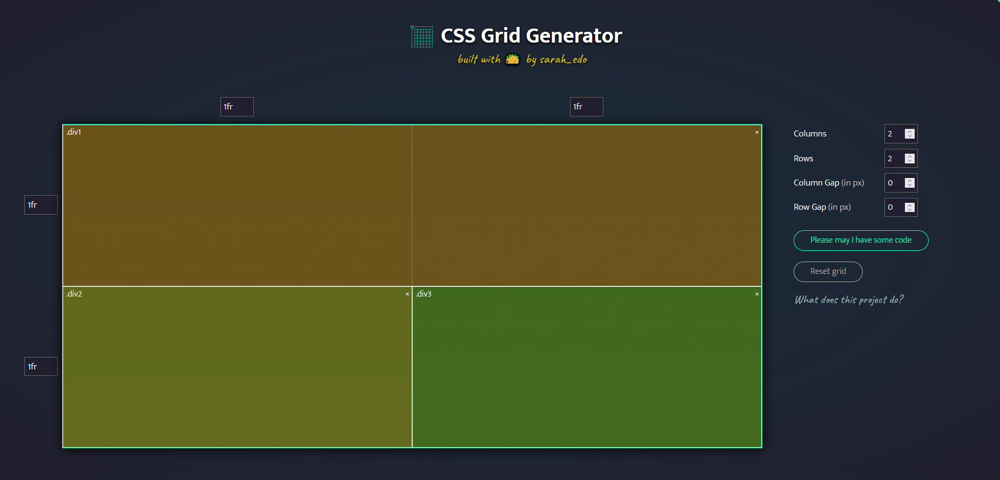
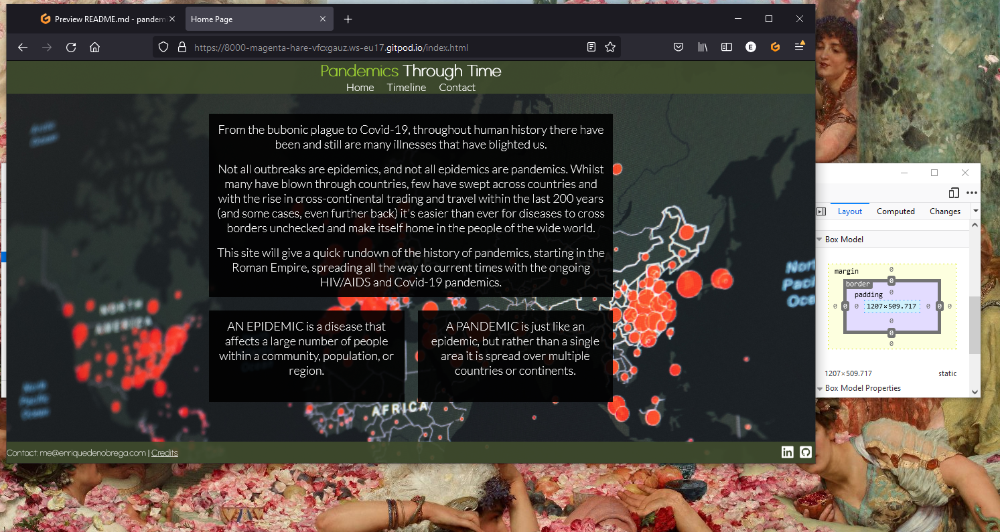

# Panedmics Through Time

__Pandemics through time__ is an informational website with the purpose of giving people a brief history of pandemics we have had throughout the years, as for many people, outside of the bubonic plague, the current ongoing Covid-19 pandemic is one of the most deadly disease to harm and kill humans in the last 100 years, and this site aims to give people a starting to point to get a rough understanding of other pandemics.

## UX
For the design I opted to have a background image covering the whole page rather than having a solid color. Any sort of text that is displayed will be inside of a transparent box to help with readability without completely hiding the background image. Elements will have padding on both left and right and be typically always be kept centered on screen, as this is a site used to convey information in a specific order having them all inline going down the page will make it extremely easy for people to go through the website and see everything without missing out. On the page for signing up for the newsletter, the input boxes will darken and there borders will change color too clearly convey that the input is selected.

### Color Scheme
I used [colormind](http://colormind.io/) to find a color pallete for my site, using the one shown below. I chose these because when talking about disease and illness, lighter shades of green and yellow are typically the first colors that come to mind and are used in many paintings and artwork depicting disease. Although I do not plan on using all the colors outside of the first two, as I plan on having the background as an image and black textboxes with white text for readability.

*Scheme Used*

### Typography
To select my fonts I used [google fonts](https://fonts.google.com/)

I chose to use a more decorative font, [urbanist](https://fonts.google.com/specimen/Urbanist), for the title and headers, and opted for a more readable font, [Lato](https://fonts.google.com/specimen/Lato), for the paragraphs of text.
For the links on the footer I used font-awesome as it's easy to use and has many logos for any sort of website I would like to link.

In the footer I used [fontawesome](https://fontawesome.com/) to have a icon for Linkdein and github.
### Wireframes

*Final wireframe for homepage*

*Wireframe for timeline*

*Wireframe for newsletter signup*

## Features
### Existing Features
- Header / Navigation bar
    - On all 4 pages, slightly transparent and is responsive. Displays the name of the site and a navigation bar to 3 of the 4 pages.
    - Allows for easy navigation of the site.

*Header*

- Footer
    - Contains my email for contact.
    - A link to the credits where all of the sources for images etc. are listed.
    - On the right hand side are 4 icons each leading to my social medias (although I only have Linkedin).

*Footer*

- Timeline
    - The main content of the site, a vertically explored page that goes through the history of pandemics starting from the earliest known ones, to the most current one being Covid-19.
    - The start and end date (if it's ended) of the pandemic is shown on the left hand side with the left consisting of a block text and the background area being a relevant picture.

*Timeline*

- Newsletter
    - A page for users to signup for a history themed newsletter. 

*Newsletter*

### Features Left to Implement
Make the newsletter form save to a database.

## Technologies Used
- I used [git](https://git-scm.com/) for version control and storage.
- To help with using git, I used [github](https://github.com/).
- To create the layout of the three paragraphs on the home page I used css grid, to easily create the grid I used this [website](https://cssgrid-generator.netlify.app/) shown below.

- I used [html](https://en.wikipedia.org/wiki/HTML) to design the site.
- And [CSS](https://en.wikipedia.org/wiki/CSS) to style the site.
- To help with styling I used a css debugger to help me with things like positioning and size: [link](https://github.com/benscabbia/x-ray).
- For my IDE I used Gitpod, [link](https://www.gitpod.io/).

## Testing

### Browser Compatibility
 
*Index.html shown in edge*

*Timeline.html shown in firefox*

*Newsletter.html shown in chrome*
### Code Validation
For validation I used two tools from w3, for html I used [Nu Html Checker](https://validator.w3.org/nu/) and for css I used [CSS Validation Service](https://jigsaw.w3.org/css-validator/).  

#### style.css
Validation of the style sheet that styles the header and footer.

#### Index
HTML Validation, giving no errors.

CSS Validation, also giving no errors.

#### Timeline
HTML Validation, giving no errors.

CSS Validation, also giving no errors.

### Newsletter
HTML Validation, giving no errors.

CSS Validation, also giving no errors.

### Thankyou
HTML Validation, giving no errors.

CSS Validation, also giving no errors.

### Responsiveness

*Site Shown on my phone, huawei mate 20 pro*

*Site shown at 734px*

*Site shown at 880px*

*Site shown at 1200px*

*Site shown at 1920px*
### Unfixed Bugs
I am currently unaware of any bugs in the project.

## Deployment

The site was deployed to GitHub pages. The steps to deploy are as follows:
* In the [GitHub repository](https://github.com/edenobrega/pandemic-history-5p), navigate to the Settings tab.
* From the Settings tab, scroll down until you see the 'Pages' button on the left.
* From the Source section drop-down menu, select the `Main` branch.
* Once the `Main` branch has been selected, the page will be automatically refreshed with a detailed ribbon display to indicate the successful deployment.

The live link can be found here - https://edenobrega.github.io/pandemic-history-5p

## Local Deployment

To make a local copy of this project, you can clone it by typing the following in your IDE terminal:

- `git clone https://github.com/edenobrega/pandemic-history-5p.git`

Alternatively, if using Gitpod, you can click the green Gitpod button, or use [this link](https://gitpod.io/#https://github.com/edenobrega/pandemic-history-5p)

## Credits

### Content
- Definitions of pandemic and epidemic
    - https://intermountainhealthcare.org/blogs/topics/live-well/2020/04/whats-the-difference-between-a-pandemic-an-epidemic-endemic-and-an-outbreak/ 

- Information
- Antonine Plague
    - https://en.wikipedia.org/wiki/Antonine_Plague
    - https://www.smithsonianmag.com/history/what-rome-learned-deadly-antonine-plague-165-d-180974758/

- Plague of Cyprian
    - https://www.worldhistory.org/article/992/plague-of-cyprian-250-270-ce/
    - https://www.theatlantic.com/science/archive/2017/11/solving-the-mystery-of-an-ancient-roman-plague/543528/

- Plague of Justinian
    - https://jmvh.org/article/the-history-of-plague-part-1-the-three-great-pandemics/
    - https://en.wikipedia.org/wiki/Plague_of_Justinian
    - https://en.wikipedia.org/wiki/Bubonic_plague#History

- 11th Century Leprosy
    - https://sciencenorway.no/bacteria-diseases-forskningno/the-horrific-disease-that-wont-die/1464510
    - https://elizabethashworth.com/2010/07/22/leprosy-in-the-middle-ages/
    - https://historicengland.org.uk/research/inclusive-heritage/disability-history/1050-1485/time-of-leprosy/
    - https://www.britannica.com/science/leprosy/History

- Second Plague
    - https://www.history.com/news/black-death-timeline
    - https://jmvh.org/article/the-history-of-plague-part-1-the-three-great-pandemics/
    - https://en.wikipedia.org/wiki/Second_plague_pandemic
    - https://www.warhistoryonline.com/instant-articles/mongol-siege-caffa-black-plague.html
    - https://en.wikipedia.org/wiki/Black_Death

- Columbian Exchange
    - https://en.wikipedia.org/wiki/Influx_of_disease_in_the_Caribbean
    - https://www.pbs.org/gunsgermssteel/variables/smallpox.html
    - https://www.history.com/topics/middle-ages/pandemics-timeline
    - https://www.history.com/news/columbian-exchange-impact-diseases
    - https://en.wikipedia.org/wiki/Cocoliztli_epidemics
    - https://en.wikipedia.org/wiki/Native_American_disease_and_epidemics#Smallpox

- Cholera
    - http://www.ph.ucla.edu/epi/Snow/pandemic1846-63.html
    - https://en.wikipedia.org/wiki/1846%E2%80%931860_cholera_pandemic

- Third Plague
    - https://en.wikipedia.org/wiki/Third_plague_pandemic
    - https://abcnews.go.com/Health/plague-exists-now-us/story?id=55860883
    
- Russian Flu
    - https://www.ncbi.nlm.nih.gov/pmc/articles/PMC3867475/
    - https://en.wikipedia.org/wiki/1889–1890_pandemic
    - https://www.ncbi.nlm.nih.gov/pmc/articles/PMC7252012/

- Spanish Flu
    - https://en.wikipedia.org/wiki/Spanish_flu

- Influenza
    - https://en.wikipedia.org/wiki/1957–1958_influenza_pandemic
    - https://bjgp.org/content/59/565/622
    - https://www.ncbi.nlm.nih.gov/pmc/articles/PMC2714797/

- Hong Kong Flu
    - https://www.sinobiological.com/research/virus/1968-influenza-pandemic-hong-kong-flu
    - https://en.wikipedia.org/wiki/Hong_Kong_flu

- HIV/AIDS Pandemic
    - https://en.wikipedia.org/wiki/History_of_HIV/AIDS
    - https://www.avert.org/professionals/history-hiv-aids/overview
    - https://www.hiv.gov/
    - https://en.wikipedia.org/wiki/HIV/AIDS
    - https://www.unaids.org/en/resources/fact-sheet
    - https://www.history.com/topics/1980s/history-of-aids#section_2
    - https://www.americanbar.org/groups/crsj/publications/human_rights_magazine_home/human_rights_vol37_2010/spring2010/sex_trafficking_and_hiv_aids_a_deadly_junction_for_women_and_girls/

- Covid-19
    - https://www.nhs.uk/conditions/coronavirus-covid-19/
    - https://en.wikipedia.org/wiki/COVID-19
    - https://www.who.int/health-topics/coronavirus#tab=tab_1

### Media
- Background Image https://unsplash.com/photos/j2c7yf223Mk
- Footer Icons https://getbootstrap.com/

- Timeline Images
    - [Antonine Plague "The angel of death striking a door during the plague of Rome"](https://wellcomecollection.org/works/wwraaugh)
    - [Plague of Cyprian (image not related) "Plague in an Ancient City"](https://commons.wikimedia.org/wiki/File:Plague_in_an_Ancient_City_LACMA_AC1997.10.1_(1_of_2).jpg)
    - [Plague of Justinian " St. Sebastian betet für die Pestopfer"](https://commons.wikimedia.org/wiki/File:Plaguet03.jpg)
    - [11th Century Leprosy "Omne Bonum"](https://commons.wikimedia.org/wiki/File:Leprosy_victims_taught_by_bishop.jpg)
    - [Second Black Plague "Miniature by Pierart dou Tielt illustrating the Tractatus quartus bu Gilles li Muisit (Tournai, c. 1353)"](https://commons.wikimedia.org/wiki/File:Doutielt3.jpg)
    - [Columbian Exhchange "Landing of Columbus"](https://commons.wikimedia.org/wiki/File:Landing_of_Columbus_%282%29.jpg)
    - [Third Cholera Pandemic "The artist shows a case of dry cholera (cholera sicca)."](https://en.wikipedia.org/wiki/File:Fedotov_cholera.jpg)
    - [Third Plague "Man being injected by doctor, during the outbreak of bubonic plague in Karachi, India. Photograph, 1897"](https://wellcomecollection.org/works/fer536p9?wellcomeImagesUrl=/indexplus/image/V0029287.html)
    - [Flu Pandemic (also know as Russian Flu) "Three separate illustrations relating to the influenza epidemic in Paris."](https://collections.nlm.nih.gov/catalog/nlm:nlmuid-101459303-img)
    - [Spanish Flu "Emergency hospital during Influenza epidemic, Camp Funston, Kansas"](https://commons.wikimedia.org/wiki/File:Emergency_hospital_during_Influenza_epidemic,_Camp_Funston,_Kansas_-_NCP_1603.jpg)
    - [Influenza "168 sick conscripts by asian flu in a sport arena att F 21 in Luleå. Picture was taken in 1957."](https://commons.wikimedia.org/wiki/File:Asian_flu_in_Sweden_1957_(2).jpg)
    - [Hong Kong Flu "Front page of a newspaper article from the town of Cazenovia, New York, December 25th 1968" ](https://nyshistoricnewspapers.org/lccn/sn83031502/1968-12-25/ed-1/seq-1.pdf?__cf_chl_managed_tk__=pmd__K698P6Iq6zwTd_uSJQ39Weucu9L4dX7xmp5uzk195o-1634599145-0-gqNtZGzNA1CjcnBszQk9)
    - [HIV/AIDS "Photograph by Ken Regan, drowd behind fence on National Mall during Gay Rights March, 1993"](https://www.si.edu/object/gay-rights-march:nmah_1758585)
    - [Covid 19 "People in face masks strolling in Piazza di Spagna, Rome, Italy during the Covid pandemic"](https://unsplash.com/photos/-Qoi7zAf6YE)
  